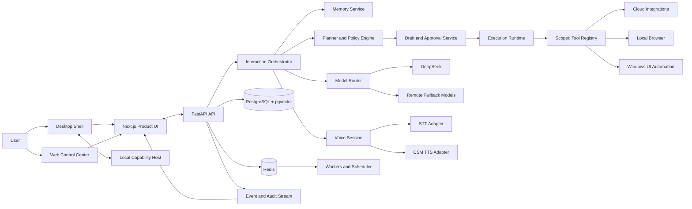

# SMTHN.GD / Lockd'In Master Product and Implementation Plan

Status: Canonical planning document
Last updated: 2026-07-17
Scope: Product, architecture, experience, implementation, validation, documentation, and release planning

## 0. Decisions Locked for This Plan

- SMTHN.GD is the company and ecosystem brand.
- Lockd'In is the first product: a proactive personal execution partner.
- The first primary experience is Windows desktop plus a web control center.
- The core is single-user in UX for the MVP, but identity and data boundaries are multi-user-ready.
- The visual concept merges a living intelligence core with a spatial command center.
- Lockd'In is local-first where practical, but may use remote models and integrations when the user enables them.
- No irreversible or externally visible action executes directly from model text.
- Three.js is functional product language, not decorative wallpaper.

## 1. Executive Direction

Lockd'In should not become a larger chatbot with a glowing sphere attached. It should become an operating layer for personal intent.

The product earns its place by doing five things well:

1. Notice what matters without collecting everything.
2. Turn context into a small number of useful next steps.
3. Execute approved work through deterministic tools.
4. Learn stable preferences without turning inference into fact.
5. Make its internal state visible enough that the user can trust it.

The central interaction model is:

```text
signal -> understand -> propose -> approve when required -> execute -> verify -> remember selectively
```

The central product promise is:

> Lockd'In keeps the important parts of your digital life moving, while keeping you in control of what it sees, remembers, and does.

## 2. Current Repository Reality

### 2.1 What Exists

The repository currently contains two disconnected implementation surfaces.

1. `jarvis.py`
   - A monolithic CLI prototype for DeepSeek text generation, Whisper input, and Sesame CSM speech.
   - Useful device detection, dry-run behavior, model loading, and initial voice integration.
   - More than one responsibility is mixed into one file: configuration, model adapters, fallback logic, conversation state, audio capture, TTS, CLI, and runtime loop.

2. `lockdin_mvp/`
   - A FastAPI PoC with PostgreSQL, Redis/Celery, Google OAuth, consent records, Google sync, event normalization, and reminders.
   - A useful repository/service/schema starting pattern.
   - Not production-ready and not yet connected to a user-facing product.

There is currently no:

- Next.js application
- Tauri or Electron desktop shell
- Three.js or React Three Fiber scene
- Authentication boundary
- Real multi-user identity propagation
- Memory auditor implementation
- Dispatcher/executor agent runtime
- Action draft and approval engine
- Windows accessibility controller
- End-to-end voice session runtime
- Product-level observability
- Integration or end-to-end test suite

### 2.2 Quality Assessment

The current code should be treated as a PoC and source material, not as the final architecture.

High-priority weaknesses:

- OAuth tokens are stored as plaintext database fields.
- API routes and worker tasks hardcode `local-user`.
- `jarvis.py` swallows many exceptions and mixes unrelated responsibilities.
- Desktop execution is not implemented.
- Sync lacks robust pagination, cursoring, quota handling, idempotency, and partial-failure recovery.
- CI validates the old root prototype, not the Lockd'In backend.
- The current plan claims work remains that has partially been implemented and omits major frontend/runtime work.
- The repository has a deleted root `.env.example` in the current worktree; this must be resolved intentionally, not silently restored or committed.

### 2.3 Keep, Reshape, Retire

#### Keep and harden

- Pydantic settings and schema validation
- SQLAlchemy repository pattern
- Alembic migrations
- Google OAuth state signing concept
- Calendar and Gmail normalization boundaries
- Celery job boundary
- Dry-run mode
- Device selection logic
- DeepSeek and CSM assets and upstream code

#### Reshape

- Google OAuth storage into encrypted credentials or hosted OAuth
- Event ingestion into cursor-based connector jobs
- Consent into a policy-enforced capability grant
- Reminders into a suggestion and automation engine
- Jarvis model code into independent STT, LLM, and TTS adapters
- FastAPI routes into versioned, authenticated, contract-tested APIs
- Redis/Celery into a job system with retry, cancellation, idempotency, and status

#### Retire or quarantine

- Extending `jarvis.py` as the main application
- Hardcoded `MVP_USER_ID`
- Plaintext token persistence
- Shell-based audio playback with interpolated text
- Broad `except Exception` blocks without structured logging
- Inline sync execution in public API routes
- Coordinate-first desktop automation
- Direct model-to-action execution

## 3. Inspiration Map

This plan borrows patterns, not source code or product identity.

### 3.1 Local Jarvis Prototype

Borrow:

- Local model ownership
- DeepSeek as a reasoning option
- Sesame CSM as a premium voice option
- Dry-run mode
- Device-aware inference
- Text-only fallback when voice/model assets are unavailable

Improve:

- Replace one giant class with adapter contracts and a session state machine.
- Add streaming, interruption, VAD, latency budgets, and observability.
- Separate product conversation memory from raw model message history.

### 3.2 Boop Agent

Borrow:

- Fast dispatcher that decides whether work is needed
- Ephemeral execution workers with tightly scoped tools
- Draft-before-send for external actions
- Tiered memory with decay and consolidation
- Automation scheduling from natural language
- Agent lifecycle, cancellation, retry, and heartbeat
- Detailed action/agent timeline in the control center
- Integration registry that exposes only enabled toolkits
- Local browser automation as an explicit opt-in capability
- One-command development preflight and clear connection status

Do not copy blindly:

- Lockd'In must not give execution workers unrestricted permission just because the dispatcher selected them.
- Lockd'In needs a policy engine and deterministic action verification between plan and execution.
- A personal-agent template can accept risks that a user-facing paid product cannot.
- Hosted integration aggregators are an option, not the only integration strategy.

### 3.3 Leon

Borrow:

- Smart, controlled, and agent execution modes
- Native deterministic skills separated from agentic skills
- Layered memory and bounded proactive behavior
- Local and remote provider flexibility
- Skills -> actions -> tools -> functions hierarchy
- Compact self-model rather than an unbounded personality prompt

### 3.4 Open Interpreter

Borrow:

- Explicit sandboxing and approval modes
- Skills, hooks, permissions, and protocol boundaries
- Browser/native UI testability as a first-class capability
- Provider and runtime adapters instead of one hardcoded model
- Local session and configuration ownership

### 3.5 LiveKit Agents

Borrow:

- Session-oriented voice runtime
- Pluggable STT, LLM, TTS, VAD, and turn detection
- Semantic end-of-turn detection
- Barge-in and interruption support
- Testable function calls and agent outcomes
- Separate console/dev/production runtime modes

Adoption decision:

- Do not adopt LiveKit as an infrastructure dependency for the earliest local MVP.
- Design the voice contracts so a LiveKit transport can be added later without replacing STT/LLM/TTS adapters.

## 4. Product Doctrine

### 4.1 The Assistant Has Modes, Not One Personality State

- Observe: collect only enabled, purpose-bound signals.
- Brief: summarize what matters now.
- Discuss: answer and reason without taking action.
- Prepare: produce plans and drafts.
- Act: execute an approved, policy-valid plan.
- Verify: inspect the result and report evidence.
- Learn: propose memory candidates after outcomes.
- Quiet: suppress proactive behavior while preserving scheduled essentials.

### 4.2 Controlled Before Agentic

Every capability declares its execution style:

- Deterministic: known input, known tool, known result.
- Assisted: model proposes parameters; deterministic code executes.
- Agentic: bounded worker may choose among scoped tools.
- Prohibited: capability cannot run in the current policy or release tier.

The model never gets more control than the task needs.

### 4.3 Proactivity Has a Budget

Every proactive suggestion must have:

- A source signal
- A purpose
- A confidence score
- An estimated interruption cost
- A relevance window
- A suppression rule
- A user-visible reason

The system should prefer one timely useful nudge over five technically correct notifications.

### 4.4 Memory Must Be Earned

No model inference writes directly to durable memory.

All inferred facts enter a candidate pipeline with:

- Provenance
- Candidate type
- Confidence
- Sensitivity
- Utility estimate
- Contradiction state
- Reinforcement count
- Expiry date
- User approval requirement

## 5. Target Experience

### 5.1 Surfaces

1. Desktop companion
   - Starts with Windows login when enabled.
   - Lives in tray and opens a focused command center.
   - Provides global shortcut, notifications, voice, action approvals, and desktop control.

2. Web control center
   - Mirrors settings, memory, integrations, automations, and activity.
   - Useful for remote inspection and configuration.
   - Does not expose local desktop-control routes remotely.

3. Compact overlay
   - Global shortcut opens a low-latency input surface.
   - Supports text, push-to-talk, and contextual commands.
   - Shows the current plan and approval state without opening the full app.

4. Notification and nudge layer
   - Meeting reminders
   - Follow-up suggestions
   - Briefing summaries
   - Action completion and failure evidence

### 5.2 Hybrid 3D Concept: Living Core + Spatial Command Center

The primary scene is full-bleed and unframed.

At the center is the Lockd'In Core: a responsive entity that communicates runtime state through shape, rhythm, material, and motion.

Around it is a spatial field of operational objects:

- Tasks as anchored pulses
- Memories as small stable constellations
- Integrations as orbiting ports
- Active workers as moving traces
- Approvals as gated rings
- Automations as scheduled arcs
- Recent events as a temporal ribbon

The scene is not a 3D file explorer. It is an at-a-glance state model.

### 5.3 Core Visual States

- Dormant: almost still, low-frequency breathing
- Ready: subtle orientation toward pointer or focus
- Listening: inward ripples and audio-reactive surface displacement
- Transcribing: narrow rotating waveform band
- Thinking: filaments gather from relevant nodes into the core
- Planning: steps arrange into an ordered orbit
- Awaiting approval: motion pauses; a clear locked halo appears
- Executing: energy travels from core to the chosen capability node
- Verifying: return pulse carries result evidence back to core
- Remembering: candidate particle enters a visible quarantine orbit
- Consolidating: related memory nodes merge only after approval logic
- Error: motion loses coherence without aggressive flashing
- Private/quiet: scene contracts and dims, showing reduced observation

### 5.4 Interaction Rules

- Hover reveals identity; click opens operational detail.
- Drag rotates only when spatial exploration is active.
- Scroll changes timeline depth, not arbitrary camera zoom.
- Keyboard navigation reaches all operational objects.
- Reduced-motion mode replaces fluid simulation with state transitions.
- WebGL fallback renders an equivalent 2D state diagram.
- No critical action depends only on color, depth, or animation.
- 3D never obscures confirmations, audit evidence, or settings.

### 5.5 Three.js Technology Direction

- React 19 and Next.js App Router
- Three.js through `@react-three/fiber`
- `@react-three/drei` for controls/helpers where appropriate
- `@react-three/postprocessing` used sparingly
- GLSL shaders for core material and state transitions
- Web Audio API analyser for local audio reactivity
- Zustand for scene state only
- TanStack Query for server state
- Playwright for interaction and viewport tests
- Canvas pixel checks to catch blank or broken scenes
- Performance telemetry for frame time, draw calls, memory, and shader compile time

Performance budgets:

- 60 FPS target on a mid-range desktop GPU
- 30 FPS minimum degraded mode
- Main scene initial load below 2.5 MB excluding optional assets
- No continuous render loop when the app is hidden or scene is static
- Dynamic DPR capped by observed frame time
- No more than two expensive post-processing passes in the MVP

## 6. Target Architecture



### 6.1 Proposed Monorepo Layout

```text
SMTHN.GD/
  apps/
    web/                    # Next.js web control center
    desktop/                # Tauri 2 Windows desktop shell
  services/
    api/                    # FastAPI HTTP/WebSocket API
    agent-runtime/          # dispatcher, workers, model router
    local-host/             # Windows UIA, browser, notifications, media
    voice-runtime/          # STT/VAD/TTS adapters and sessions
  packages/
    ui/                     # shared product components
    scene/                  # Three.js scene and state visualizations
    contracts/              # generated TypeScript API contracts
    design-tokens/          # visual tokens and motion constants
  python/
    lockdin_core/           # domain models, policies, memory, actions
    lockdin_connectors/     # Gmail, Calendar, GitHub, Slack, etc.
    lockdin_models/         # DeepSeek, remote LLM, STT, CSM adapters
  vendor/
    deepseek-v4-pro/        # upstream code or submodule reference
    csm/                    # upstream code or submodule reference
  docs/
    MASTER_PLAN.md
    ARCHITECTURE.md
    PRODUCT_SPEC.md
    SECURITY.md
    PRIVACY_MODEL.md
    MEMORY_SYSTEM.md
    ACTION_POLICY.md
    INTEGRATIONS.md
    VOICE_RUNTIME.md
    DESIGN_SYSTEM.md
    RUNBOOK.md
    ADR/
  tests/
    contract/
    e2e/
    scenarios/
  scripts/
  pyproject.toml
  package.json
  pnpm-workspace.yaml
```

### 6.2 Desktop Shell Decision

Use Tauri 2 for the desktop shell unless a prototype disproves sidecar packaging or Windows accessibility integration.

Why:

- Lower idle memory than Electron aligns with the lightweight product promise.
- Native tray, notifications, global shortcuts, window control, and autostart.
- Can package a signed local capability host as a sidecar.
- The Next.js scene and dashboard remain reusable on web.

Prototype gate:

- Prove Tauri can launch, monitor, update, and securely communicate with the Python local host.
- If sidecar packaging or accessibility signing becomes unreliable, switch the desktop shell to Electron before M3, not after product UI depends on Tauri APIs.

### 6.3 Backend Boundaries

- API layer: transport only, validation, auth context, status codes.
- Application layer: use cases and transaction boundaries.
- Domain layer: policies, memory decisions, action/risk types.
- Infrastructure layer: SQLAlchemy, Redis, providers, OS adapters.
- Workers: invoke application use cases, never duplicate business logic.

### 6.4 Identity Strategy

MVP UX remains single-user, but the core receives a real `ActorContext` on every request and job.

```text
ActorContext
  user_id
  device_id
  session_id
  trust_level
  enabled_capabilities
  locale
  timezone
```

No repository or service is allowed to invent or hardcode a user ID.

### 6.5 Event Spine

All meaningful state changes emit typed events:

- conversation.turn.received
- agent.run.started
- agent.tool.requested
- action.plan.created
- action.approval.requested
- action.executed
- action.verified
- memory.candidate.created
- memory.promoted
- integration.sync.completed
- automation.triggered
- voice.state.changed

The control center subscribes over WebSocket or Server-Sent Events for reactive updates.

## 7. Core Domain Model

### 7.1 Product Entities

- User
- Device
- Session
- Conversation
- Message
- IntegrationConnection
- ConsentGrant
- Signal
- Event
- Suggestion
- Automation
- AutomationRun
- AgentRun
- AgentStep
- ToolInvocation
- ActionPlan
- ActionStep
- ActionApproval
- ActionRun
- VerificationEvidence
- MemoryCandidate
- MemoryRecord
- MemoryEvent
- ModelInvocation
- UsageRecord
- Notification
- UserSetting

### 7.2 Action Risk Tiers

- R0 Observe: read local state or connected data already consented for the purpose.
- R1 Suggest: generate a draft, reminder, plan, or navigation suggestion.
- R2 Confirm: open links, join meetings, type into an unsent field, change local app state.
- R3 Strong confirm: send messages, create/update cloud records, share files, modify repositories.
- R4 Blocked by default: delete data, financial transactions, credential changes, security settings, legal commitments.

R4 can only become available through explicitly implemented deterministic workflows with separate policy review. It is not an MVP target.

### 7.3 Action Lifecycle

```text
intent
  -> structured plan
  -> capability and risk classification
  -> dry-run preview
  -> approval if required
  -> execution with scoped tools
  -> verification against expected state
  -> audit event
  -> optional memory candidate
```

### 7.4 Memory Tiers

- Working: current turn/session, expires quickly.
- Episodic: recent events and outcomes, time-bound.
- Semantic: facts explicitly supplied or verified.
- Preference: stable user choices with provenance.
- Procedure: validated routine such as meeting setup.
- Permanent: explicit identity or policy records that do not decay automatically.

### 7.5 Memory Worthiness

Candidate score is explainable, not a single opaque model output.

```text
worthiness =
  utility
  * confidence
  * recurrence
  * stability
  * provenance_quality
  * user_signal
  - sensitivity_penalty
  - contradiction_penalty
  - storage_cost_penalty
```

Promotion rules:

- Sensitive inferred traits require explicit approval.
- One-off behavior does not become a preference.
- Contradictions suspend both memories pending resolution.
- Unused memories decay and archive.
- The user can inspect why every memory exists.
- Deletion removes the record, embeddings, derived summaries, and future recall eligibility.

## 8. Feature Portfolio

### 8.1 P0 MVP Features

- Desktop tray app and command center
- Text chat with streaming response
- Hybrid Three.js core scene
- Google Calendar and Gmail connection
- Startup and morning brief
- Upcoming meeting detection
- Join Prepared flow with confirmation
- Meeting preference settings (mic off, camera off)
- Suggestion inbox with explain-why
- Memory candidates with approve/reject/delete
- Action drafts and confirmation
- Activity/audit timeline
- Basic automations and reminders
- Optional push-to-talk voice
- Local DeepSeek or remote fallback model routing
- CSM voice output where hardware permits
- Safe dry-run mode

### 8.2 P1 Private Beta Features

- Slack and GitHub integrations
- Browser automation with persistent local profile
- Windows UI Automation for known workflows
- Follow-up tracker from meetings and email
- Focus mode and interruption budgets
- Memory consolidation and contradiction resolution
- Agent run timeline and retry/cancel
- Cost, latency, and provider dashboard
- Integration health and reconnect UX
- Offline degraded mode
- Signed desktop updates

### 8.3 P2 Expansion Features

- Outlook, Teams, Notion, Linear, Drive, Docs, and task managers
- Multi-device continuity
- Mobile companion
- Voice wake word after privacy validation
- Visual screen grounding fallback
- Marketplace/skills registry
- Shared household or team spaces
- Billing and capability tiers
- Organization policy packs

## 9. Signature Experiences

These are product differentiators, not generic feature checkboxes.

### 9.1 Start-of-Day Lock-In

- Reads enabled calendar and priority signals.
- Produces a three-part brief: must happen, should happen, can wait.
- Shows why each item was selected.
- Lets the user convert suggestions into a focus sequence.
- Core scene pulls relevant task nodes into a near orbit.

### 9.2 Join Prepared

- Detects a meeting within the lead window.
- Resolves the meeting provider and join URL.
- Shows expected actions before execution.
- Opens the meeting through a provider-specific deterministic workflow.
- Sets mic/camera preferences only after element verification.
- Stops immediately when the UI does not match expectations.
- Records evidence and asks whether the routine should be remembered.

### 9.3 Context Capsule

Before a meeting or task, Lockd'In assembles a bounded capsule:

- Relevant calendar description
- Recent related email thread summaries
- Last explicit notes
- Open follow-ups
- Known participants and user-approved relationship context

The capsule expires after the event unless the user promotes an item.

### 9.4 Soft Critic

- Notices overdue or repeatedly deferred commitments.
- Uses the user's configured tone and interruption budget.
- Offers one specific next step, not a lecture.
- Learns whether the nudge helped from dismiss, snooze, act, and outcome signals.

### 9.5 Recovery Mode

When the user has missed a plan:

- Do not repeat every alert.
- Recompute from current reality.
- Present the smallest viable recovery sequence.
- Archive obsolete suggestions.

### 9.6 Explain Why

Every proactive item can answer:

- Why now?
- What data was used?
- What will happen if I approve?
- What will be stored afterward?
- How do I stop this behavior?

## 10. Milestone Roadmap

Milestones are outcome gates, not dates. A milestone is complete only when its exit criteria pass.

## M0 - Repository Truth, Security, and Development Baseline

Goal: stop compounding the PoC and make the repository safe to change.

Tasks:

- M0-T01 Create canonical architecture and product documents.
- M0-T02 Add root `.gitignore`, secret scanning, and pre-commit protection.
- M0-T03 Resolve the deleted root `.env.example` intentionally.
- M0-T04 Rotate any credentials previously committed or displayed.
- M0-T05 Replace split requirements files with a Python 3.11 `pyproject.toml` and lockfile.
- M0-T06 Add root package workspace for frontend/desktop packages.
- M0-T07 Separate vendor/upstream model code from product-owned code.
- M0-T08 Add lint, format, typecheck, unit test, and secret scan CI.
- M0-T09 Add architecture decision records for desktop shell, persistence, model routing, and integration strategy.
- M0-T10 Mark current `lockdin_mvp` and `jarvis.py` as migration sources, not canonical runtime entrypoints.
- M0-T11 Add a single `dev doctor` command that checks Python, Node, Postgres, Redis, model assets, and ports.
- M0-T12 Define environment variable inventory and secret ownership.

Exit criteria:

- No known secret exists in reachable git history.
- CI fails on secret leaks, lint/type errors, or failing tests.
- One documented command reports local environment readiness.
- New product code has a canonical destination.

## M1 - Core Domain and Backend Reshape

Goal: establish secure, testable foundations before adding more features.

Tasks:

- M1-T01 Create `ActorContext` and remove every hardcoded user ID.
- M1-T02 Introduce users, devices, sessions, and conversation tables.
- M1-T03 Encrypt integration credentials at rest for local MVP.
- M1-T04 Define production migration path to KMS or hosted OAuth token custody.
- M1-T05 Create application use-case layer and transaction boundaries.
- M1-T06 Convert API errors to RFC 9457-style Problem Details.
- M1-T07 Add structured JSON logging with correlation, turn, job, and action IDs.
- M1-T08 Add CORS, trusted hosts, rate limits, and request size limits.
- M1-T09 Replace deprecated FastAPI startup events with lifespan management.
- M1-T10 Add idempotency keys to mutations and jobs.
- M1-T11 Add health, readiness, dependency, and version endpoints.
- M1-T12 Add API contract generation for TypeScript clients.
- M1-T13 Create unit and Postgres integration test fixtures.
- M1-T14 Repair event uniqueness, timezone, and source-account constraints.
- M1-T15 Add audit event append-only storage.

Exit criteria:

- No route or worker invents an identity.
- Tokens are unreadable in raw database output.
- Core use cases pass unit and integration tests.
- API schema generates a compiling TypeScript client.

## M2 - Product Shell and Living Core Prototype

Goal: establish a real product surface and validate the hybrid 3D language early.

Tasks:

- M2-T01 Scaffold Next.js App Router application.
- M2-T02 Create design tokens: color, type, spacing, motion, depth, status.
- M2-T03 Build navigation for Today, Assistant, Activity, Memory, Automations, Connections, Settings.
- M2-T04 Implement full-bleed React Three Fiber scene shell.
- M2-T05 Build living core shader and state machine.
- M2-T06 Add spatial nodes for tasks, memories, integrations, and active actions.
- M2-T07 Add 2D operational overlays with accessible focus order.
- M2-T08 Add reduced-motion and WebGL fallback modes.
- M2-T09 Add responsive desktop, laptop, and mobile web layouts.
- M2-T10 Add scene performance monitor and dynamic quality levels.
- M2-T11 Add Playwright screenshots and canvas nonblank pixel checks.
- M2-T12 Connect scene state to a mocked event stream.
- M2-T13 Build desktop overlay visual prototype.

Exit criteria:

- The scene visibly communicates at least six runtime states.
- No critical control depends on WebGL.
- Desktop and mobile screenshots have no overlap or clipped controls.
- Canvas remains nonblank and above minimum FPS on target hardware.

## M3 - Windows Desktop Shell and Local Capability Host

Goal: make Lockd'In always present without making the web server a desktop controller.

Tasks:

- M3-T01 Prototype Tauri 2 shell with tray, autostart, global shortcut, and notifications.
- M3-T02 Package and supervise a Python local-host sidecar.
- M3-T03 Establish authenticated local IPC with per-installation keys.
- M3-T04 Reject remote access to local capability routes.
- M3-T05 Add desktop app status, restart, and diagnostic controls.
- M3-T06 Add secure local data paths and permissions.
- M3-T07 Add update channel abstraction and signing plan.
- M3-T08 Add crash recovery and sidecar heartbeat.
- M3-T09 Validate memory/CPU idle budgets.
- M3-T10 Run the Tauri-versus-Electron decision gate.

Exit criteria:

- Desktop shell starts at login when enabled.
- Local host cannot be invoked from a non-local origin.
- Tray, overlay, notifications, and global shortcut work on Windows.
- Shell and sidecar recover from independent crashes.

## M4 - Conversation Runtime and Model Router

Goal: replace the Jarvis loop with a testable, provider-independent runtime.

Tasks:

- M4-T01 Define model adapter contract for streaming chat and structured output.
- M4-T02 Extract DeepSeek loading into a provider adapter.
- M4-T03 Add StepFun and Nemotron-compatible remote adapters only after key/provider validation.
- M4-T04 Add deterministic fallback for unavailable models.
- M4-T05 Build interaction dispatcher with a minimal tool surface.
- M4-T06 Build execution runner with per-run scoped tools.
- M4-T07 Add model selection by latency, privacy, task class, and cost ceiling.
- M4-T08 Add turn, token, latency, cache, and error telemetry.
- M4-T09 Add streaming WebSocket/SSE conversation API.
- M4-T10 Add cancellation and timeout propagation.
- M4-T11 Add structured action-plan schema and validation.
- M4-T12 Add scenario tests for direct response versus worker spawn.
- M4-T13 Add prompt/version registry and evaluation fixtures.

Exit criteria:

- Chat works with a fake provider, local DeepSeek adapter, and one remote adapter.
- Provider failure degrades without losing the conversation.
- Dispatcher cannot invoke heavy tools directly.
- Every model call has traceable usage and latency.

## M5 - Integration Registry and Event Spine

Goal: turn integrations into reliable, scoped capabilities instead of bespoke route logic.

Tasks:

- M5-T01 Define connector manifest and capability registry.
- M5-T02 Refactor Google Calendar and Gmail into manifest-based connectors.
- M5-T03 Add encrypted connection records and account identity aliases.
- M5-T04 Add sync cursors, pagination, delta sync, retries, and quota backoff.
- M5-T05 Separate Calendar and Gmail failures within a sync run.
- M5-T06 Add connection health, last sync, next retry, and reconnect states.
- M5-T07 Enforce consent before tool registration and before each invocation.
- M5-T08 Emit typed sync and connection events.
- M5-T09 Add event deduplication and normalized provenance.
- M5-T10 Evaluate Composio for broad beta integrations versus first-party connectors.
- M5-T11 Document the integration SDK and test contract.
- M5-T12 Add Slack and GitHub as the first post-Google connectors.

Exit criteria:

- Google sync resumes correctly from cursors.
- Revoking consent removes capability availability immediately.
- A connector failure is visible, retryable, and does not corrupt other sources.
- A new read-only connector can be added without changing the dispatcher.

## M6 - Memory Candidate, Recall, and Consolidation

Goal: build the trust-critical differentiator before personalization claims expand.

Tasks:

- M6-T01 Add memory candidate and memory record schemas.
- M6-T02 Build post-turn candidate extraction as a background job.
- M6-T03 Add deterministic sensitivity and provenance checks.
- M6-T04 Implement worthiness scoring and tier recommendations.
- M6-T05 Add explicit approval for sensitive and permanent memories.
- M6-T06 Add contradiction detection and suspended state.
- M6-T07 Add recall with metadata filters and pgvector.
- M6-T08 Add access reinforcement, decay, archive, and prune jobs.
- M6-T09 Add proposer/judge consolidation only after deterministic baseline tests.
- M6-T10 Build Memory table, candidate inbox, timeline, and spatial graph.
- M6-T11 Add complete delete and export behavior.
- M6-T12 Add memory evaluation set for precision, contradiction, and overcollection.

Exit criteria:

- No inferred fact reaches durable memory outside the candidate pipeline.
- Users can explain, correct, reject, export, and delete memories.
- Recall evaluation meets agreed precision before proactive use consumes memory.

## M7 - Suggestions, Briefs, and Automations

Goal: make Lockd'In useful before it controls the desktop.

Tasks:

- M7-T01 Build suggestion model with source, reason, relevance window, and interruption cost.
- M7-T02 Build morning/startup brief.
- M7-T03 Build meeting reminder and context capsule.
- M7-T04 Add natural-language automation creation with validated schedule output.
- M7-T05 Add automation enable, disable, edit, run-now, and delete.
- M7-T06 Add dedicated scheduler ownership and distributed lock.
- M7-T07 Add automation run history, retry, and failure notifications.
- M7-T08 Build interruption budget and quiet mode.
- M7-T09 Add dismiss, snooze, act, and usefulness feedback.
- M7-T10 Build Today view and spatial temporal ribbon.

Exit criteria:

- Startup brief is generated from consented, current data.
- Automations do not double-fire under multiple workers.
- Every suggestion can explain why it appeared and how to suppress it.

## M8 - Drafts, Policy Engine, and Safe Actions

Goal: create the safety boundary that all desktop and external actions use.

Tasks:

- M8-T01 Implement typed risk and capability policy rules.
- M8-T02 Add ActionPlan and ActionStep validation.
- M8-T03 Implement draft save, approve, reject, expire, and supersede.
- M8-T04 Build plan preview and diff UI.
- M8-T05 Add scoped capability tokens for each execution run.
- M8-T06 Add execution timeout, cancellation, and heartbeat.
- M8-T07 Add expected-state verification and evidence records.
- M8-T08 Add policy simulation tests and adversarial action prompts.
- M8-T09 Build action timeline with tool inputs redacted by policy.
- M8-T10 Block unknown or unverified actions by default.

Exit criteria:

- External writes cannot occur without the required approval path.
- A model cannot expand its tool scope during execution.
- Every completed action has verification evidence or is marked unverified.

## M9 - Windows UI Automation and Join Prepared

Goal: prove one narrow, trustworthy desktop workflow.

Tasks:

- M9-T01 Build Windows UI Automation adapter using semantic roles and names.
- M9-T02 Add process/window discovery and focus tools.
- M9-T03 Add element inspection, scroll-into-view, invoke, toggle, and value actions.
- M9-T04 Build dry-run accessibility tree preview.
- M9-T05 Create provider workflows for Zoom, Google Meet, and Teams.
- M9-T06 Verify meeting URL and target application before interaction.
- M9-T07 Apply mic/camera preferences only when controls are positively identified.
- M9-T08 Abort on ambiguity or unexpected state.
- M9-T09 Store redacted execution evidence.
- M9-T10 Add replayable fixtures and Windows integration tests.
- M9-T11 Keep coordinate clicks behind a separate experimental capability.

Exit criteria:

- Join Prepared succeeds on supported versions and fails closed elsewhere.
- No coordinate-only click exists in the default path.
- User can preview and cancel every action.

## M10 - Realtime Voice and CSM Presence

Goal: make voice feel alive without coupling product reliability to heavy local models.

Tasks:

- M10-T01 Define voice session state machine.
- M10-T02 Extract CSM into a TTS adapter with warmup and health status.
- M10-T03 Add Whisper/faster-whisper STT adapter.
- M10-T04 Add VAD and semantic end-of-turn evaluation.
- M10-T05 Add streaming partial transcription and response.
- M10-T06 Add barge-in and TTS cancellation.
- M10-T07 Add push-to-talk as default privacy mode.
- M10-T08 Add audio device selection and diagnostics.
- M10-T09 Drive Three.js core from voice states and amplitude data.
- M10-T10 Add latency budgets and degraded voice modes.
- M10-T11 Add transcript privacy controls and retention.
- M10-T12 Evaluate LiveKit transport for remote/mobile voice after local MVP.

Exit criteria:

- Push-to-talk completes a conversational turn with visible state transitions.
- User can interrupt speech.
- Voice failure falls back to text without losing the task.
- P95 latency is measured for each voice stage.

## M11 - Spatial Command Center Completion

Goal: make the 3D scene operationally valuable rather than a one-time visual effect.

Tasks:

- M11-T01 Bind real event stream to core and node states.
- M11-T02 Add task and automation orbit with status encoding.
- M11-T03 Add memory constellation with cluster filters.
- M11-T04 Add integration ports and health state.
- M11-T05 Add active agent traces and tool touchpoints.
- M11-T06 Add approval gate visualization.
- M11-T07 Add temporal navigation for recent activity.
- M11-T08 Add focus transitions between Today, Memory, Activity, and Connections.
- M11-T09 Add scene bookmarks and camera reset.
- M11-T10 Add accessibility mirror list for all visible nodes.
- M11-T11 Finalize reduced-motion, low-power, and no-WebGL modes.

Exit criteria:

- Scene state matches backend state under automated tests.
- Every spatial object has an accessible 2D equivalent.
- The scene improves navigation or comprehension in user tests.

## M12 - Reliability, Security, Packaging, and Private Beta

Goal: make the MVP installable, supportable, and safe enough for real personal use.

Tasks:

- M12-T01 Add threat model and security review for local/remote boundaries.
- M12-T02 Add dependency and secret scanning.
- M12-T03 Add structured redaction tests for logs and audit events.
- M12-T04 Add backup, restore, export, and delete flows.
- M12-T05 Add desktop installer, signing, and update channel.
- M12-T06 Add crash reporting with user-controlled telemetry.
- M12-T07 Add performance and soak tests.
- M12-T08 Add scenario evaluations for hallucinated actions and memory poisoning.
- M12-T09 Add first-run setup wizard.
- M12-T10 Add diagnostics bundle with secret redaction.
- M12-T11 Complete documentation set and troubleshooting matrix.
- M12-T12 Run private beta readiness review against acceptance criteria.

Exit criteria:

- Fresh Windows install reaches first useful brief without developer intervention.
- User can disconnect, delete, export, and disable local capabilities.
- Security, privacy, reliability, and recovery checks pass.

## M13 - Post-MVP Expansion and Commercialization

Goal: grow capability without weakening trust or product coherence.

Tasks:

- M13-T01 Capability-based pricing and metering.
- M13-T02 Hosted account and multi-device sync.
- M13-T03 Connector marketplace and skill signing.
- M13-T04 Mobile companion and remote approvals.
- M13-T05 Organization policies and managed integrations.
- M13-T06 Privacy-preserving telemetry and product analytics.
- M13-T07 Advanced proactive intelligence experiments.
- M13-T08 Shared spaces with explicit memory boundaries.

Exit criteria:

- Commercial features preserve the same consent, action, and memory invariants.
- Paid tiers are based on measurable capability cost and value, not artificial UI restrictions.

## 11. MVP Cut Line

The MVP is not "all milestones complete." The MVP cut is:

- M0 complete
- M1 complete
- M2 complete
- M3 complete
- M4 complete
- M5 complete for Google only
- M6 candidate/review/recall complete; advanced consolidation may follow
- M7 startup brief, meeting reminder, and basic automations complete
- M8 complete
- M9 Join Prepared complete for at least one meeting provider
- M10 push-to-talk and CSM output available as optional capability
- M11 core operational bindings complete for Today, Activity, Memory, Connections
- M12 private beta minimums complete

MVP demonstration flow:

1. User launches Lockd'In from Windows.
2. Living core reports system readiness and integration health.
3. User connects Google and grants purpose-specific consent.
4. Lockd'In syncs the calendar and produces a bounded Today brief.
5. A meeting approaches and Join Prepared appears with an explanation.
6. User previews and approves the plan.
7. Lockd'In opens the meeting and safely applies verified preferences.
8. Action evidence appears in Activity.
9. A memory candidate proposes the stable meeting preference.
10. User approves or rejects the memory.
11. The next relevant meeting uses the approved preference but still follows policy.

## 12. Parallel Workstreams

After M0, work can proceed in controlled parallel tracks.

### Track A - Platform

M1, M3, M12

### Track B - Product UI and 3D

M2, M11

### Track C - Intelligence

M4, M6, M7

### Track D - Integrations and Actions

M5, M8, M9

### Track E - Voice

M10

Dependency rules:

- M8 must precede live M9 execution.
- M1 identity and encryption must precede production-like M5 connections.
- M4 contracts must precede M10 model integration.
- M2 scene state machine can use mocks before M4-M7 event sources exist.
- M6 memory must not consume unverified action outcomes before M8 verification exists.

## 13. Testing and Evaluation Strategy

### 13.1 Test Pyramid

- Unit: domain policies, scoring, parsing, adapters
- Contract: OpenAPI clients, connector manifests, event schemas
- Integration: Postgres, Redis, Google mocks, worker retries
- Scenario: conversation -> plan -> approval -> action -> verification
- UI: component and accessibility tests
- E2E: browser plus desktop shell flows
- Visual: screenshots at desktop/mobile viewports
- Canvas: nonblank, expected color/state regions, frame movement
- Agent evaluation: tool choice, refusal, memory quality, action safety
- Soak: scheduler, WebSocket, voice, sync, and worker stability

### 13.2 Golden Scenarios

- Upcoming meeting with known URL
- Meeting with missing or malformed link
- Revoked Calendar consent
- Expired OAuth token with successful refresh
- Expired token with failed refresh
- Conflicting meeting preferences
- User rejects memory candidate
- Model proposes unsupported action
- UI changes and target element cannot be found
- User interrupts voice mid-response
- Redis unavailable during automation trigger
- Desktop sidecar restarts during action

### 13.3 Quality Gates

Every milestone requires:

- Tests for success and failure paths
- Updated architecture/contracts
- Security/privacy review for new capabilities
- Observability for new background work
- Owner action checklist updates
- No new secret or generated-state leakage

## 14. Documentation System

Required canonical documents:

- `README.md`: product overview and fastest safe start
- `docs/PRODUCT_SPEC.md`: users, jobs, scope, acceptance criteria
- `docs/ARCHITECTURE.md`: current architecture, not future aspiration
- `docs/SECURITY.md`: threat model, secret handling, disclosure
- `docs/PRIVACY_MODEL.md`: data inventory, purposes, retention, deletion
- `docs/MEMORY_SYSTEM.md`: candidates, tiers, scoring, consolidation
- `docs/ACTION_POLICY.md`: risk tiers, approvals, verification
- `docs/INTEGRATIONS.md`: connector contract and connection lifecycle
- `docs/VOICE_RUNTIME.md`: adapters, states, latency, privacy
- `docs/DESIGN_SYSTEM.md`: visual language, motion, 3D semantics
- `docs/RUNBOOK.md`: local, staging, production operations
- `docs/TESTING.md`: commands, fixtures, scenarios, evaluation sets
- `docs/ADR/`: immutable architectural decision records
- `CHANGELOG.md`: user-visible changes and breaking setup changes

Documentation rule:

- Planning documents describe intended work.
- Architecture documents describe only what exists now.
- Any merged capability updates both its owner checklist and operating docs.

## 15. Developer Experience

One-command goals:

```text
pnpm setup          # interactive setup, secrets stay local
pnpm dev            # web + API + workers + desktop in development
pnpm doctor         # dependency and connection checks
pnpm test           # fast unit and contract suite
pnpm test:e2e       # browser and desktop scenarios
pnpm lint           # all languages
pnpm format         # all languages
```

Development modes:

- Demo: fake providers, seeded events, no external credentials
- Local: Postgres/Redis, real local models optional
- Connected: real OAuth/integrations, sandbox accounts
- Production: signed desktop app, hardened services

The demo mode must be realistic enough to exercise the full UI and 3D state model without external accounts.

## 16. Security and Privacy Non-Negotiables

- No plaintext OAuth tokens in persistent storage.
- No secrets in frontend bundles, logs, prompts, or audit payloads.
- Local capability routes reject forwarded/public requests.
- Browser typed values are redacted before logging.
- Desktop actions require scoped, expiring capability grants.
- Model output is untrusted input.
- All external writes follow policy and draft/approval rules.
- Consent is checked at ingestion and invocation, not only at connection time.
- Data has purpose, provenance, retention, and deletion behavior.
- Always-on microphone is off by default.
- Screen capture is off by default and visually indicated when active.
- Memory inference is visible and reversible.

## 17. Observability

Every request or action receives correlated IDs:

- trace_id
- conversation_id
- turn_id
- agent_run_id
- action_run_id
- job_id
- device_id

Control center views:

- System health
- Model latency and fallbacks
- Agent runs and tool calls
- Automations and next run
- Integration health and sync cursor
- Memory candidate and consolidation events
- Action approvals and verification
- Cost/token estimates
- Local capability availability

Metrics:

- P50/P95 first-token latency
- P50/P95 voice turn latency
- Action success and verification rate
- User cancellation rate by action type
- Suggestion act/dismiss/snooze rate
- Memory approve/reject/rollback rate
- Connector refresh and sync failure rate
- Worker retry and dead-letter rate
- Scene FPS and degraded-mode activation

## 18. Product Backlog of Greatness

These ideas are candidates, not MVP commitments.

- Focus ritual that turns a brief into a bounded work session
- Ambient progress state without constant notifications
- "What changed while I was away?" return brief
- Relationship-aware follow-up reminders with strict sensitivity controls
- Draft inbox for all external actions
- Personal operating manual generated only from approved preferences
- Energy-aware task ordering set explicitly by the user
- Meeting debrief that extracts candidate commitments
- Context handoff between desktop and mobile
- Visual memory neighborhoods with contradiction markers
- Skill rehearsal in simulation before granting live permissions
- Personal weekly review with evidence and trend explanations
- Integration recipes shared without sharing user data
- Portable encrypted profile export
- Local-only mode that disables all remote providers
- Cost-aware provider routing with per-feature budgets
- "Show me what you know" interactive transparency session
- "Forget this topic" semantic deletion workflow
- Safe browser login handoff for MFA
- Recovery plans after missed deadlines or failed automations
- Quiet companion mode with only user-defined critical interrupts
- Signed community skills with declared permissions and test suites

## 19. Decisions Still Open

These do not block M0-M2 but must be resolved at their decision gates.

1. Tauri 2 versus Electron after sidecar/accessibility prototype.
2. First-party OAuth connectors versus Composio for broad beta catalog.
3. Local encrypted Postgres credentials versus hosted token vault for production.
4. Faster-whisper versus Whisper baseline for Windows hardware targets.
5. LiveKit transport for remote/mobile voice after local session validation.
6. DeepSeek checkpoint size and minimum supported hardware profile.
7. Visual art direction details: typography, palette, material, sound identity.
8. First supported meeting provider for Join Prepared.
9. Auth provider for web account and future multi-device support.
10. Telemetry default and private beta consent language.

## 20. Immediate Next Move

Do not start with more integrations or desktop autonomy.

Start M0, then build the M2 living-core prototype in parallel with M1 contracts once the workspace is clean.

Recommended first execution batch:

1. Create root workspace and canonical project structure.
2. Establish secure Python/Node toolchains and CI.
3. Extract domain contracts and fake event stream.
4. Scaffold Next.js and the Three.js living core using mocked states.
5. Begin identity/token encryption backend reshape.
6. Keep the old backend and Jarvis runtime runnable until replacements have tests.

This creates visible product momentum without burying architectural risk under more PoC code.

## 21. Reference Repositories

- Boop Agent: https://github.com/raroque/boop-agent
- Boop Architecture: https://github.com/raroque/boop-agent/blob/main/ARCHITECTURE.md
- Boop Integrations: https://github.com/raroque/boop-agent/blob/main/INTEGRATIONS.md
- Leon: https://github.com/leon-ai/leon
- Open Interpreter: https://github.com/OpenInterpreter/open-interpreter
- LiveKit Agents: https://github.com/livekit/agents
- Local DeepSeek implementation: `DeepSeek-V4-Pro/`
- Local Sesame CSM implementation: `csm/`
- Current voice prototype: `jarvis.py`
- Current backend PoC: `lockdin_mvp/`
